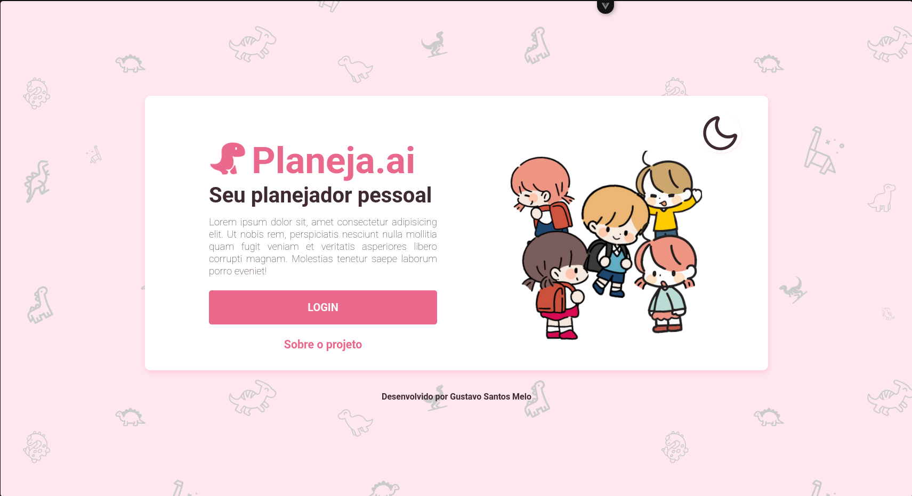

<h1>
  
  Planossauro Frontend
</h1>


Planosaurus is a planning management platform that allows users to create, manage, and preview weekly and daily planning documents with customizable templates.

## Features

- **Planning Management**: Create and manage weekly and daily plans
- **Document Preview**: Real-time document preview with multiple template styles
- **Template Customization**: Choose from various template styles and types
- **Authentication**: GitHub and Google OAuth integration
- **Payments**: Stripe integration for subscription plans
- **Internationalization**: Support for Portuguese (Brazil) and English
- **Dark/Light Mode**: Toggle between themes

## Screenshots

| Dashboard | Plan Editor |
|-----------|-------------|
|  |  |

| Template Selection | Document Preview |
|--------------------|------------------|
|  |  |

## Prerequisites

- Node.js 18+ and npm
- A running backend server (or configure `VITE_API_URL` for API endpoints)

## Installation

1. Clone the repository:
```bash
git clone <repository-url>
cd planossauro-frontend
```

2. Install dependencies:
```bash
npm install
```

## Development

Start the development server:

```bash
npm run dev
```

The application will be available at `http://localhost:5173`.

## Docker

### Development

```bash
docker build -f dev.Dockerfile -t planossauro-dev .
docker run -p 5173:5173 -v $(pwd):/app planossauro-dev
```

### Production

```bash
docker build -t planossauro .
docker run -p 8080:8080 planossauro
```

## Build

Create a production build:

```bash
npm run build
```

Preview the production build:

```bash
npm run preview
```

## Linting

Run the linter:

```bash
npm run lint
```

Fix linting issues automatically:

```bash
npm run lint:fix
```

## Tech Stack

- **Framework**: Vue 3 with Composition API (`<script setup>`)
- **Language**: TypeScript
- **Build Tool**: Vite
- **Router**: Vue Router 4
- **State Management**: Vue Provide/Inject with Composition API
- **Internationalization**: Vue i18n
- **HTTP Client**: Axios
- **Date Picker**: @vuepic/vue-datepicker
- **UI Icons**: PrimeIcons
- **Utilities**: VueUse, Lodash ES
- **Document Generation**: docxtemplater, pizzip
- **Styling**: SCSS

## License

Private - All rights reserved
